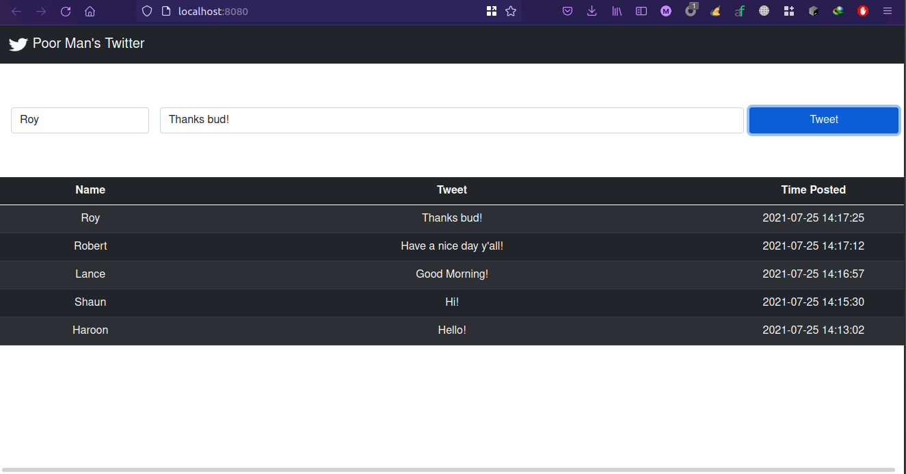

# Poor Man's Twitter


# Django Setup

## Installation Guide
```
https://docs.djangoproject.com/en/3.2/topics/install/
```

## Install djangorestframework
```
pip install djangorestframework
```
# Vue Setup

## Project setup
```
Install vue, axios using npm
```

# Running Poor Man's Twitter
```
1) python manage.py runserver (should be on port 8000)
```
```
2) Open new terminal and cd poormans_vue
```
```
3) npm run serve (should be on port 8080)
```
```
4) open http://localhost:8080 on your browser
```

# Important Notes

### Add secret key to your environment or .env file in root folder
```
django-insecure-(i517xtae4t=-*43re4jik!84f@!n76v#8!35_!pfxx_+!azic
```
